# Placemark 1.0: Adventure Tracker

A full-stack Node.js/Hapi application for tracking and sharing adventure locations in Ireland. Built with a robust architecture that supports multiple database engines and secure user authentication.

[Render Deployment](https://placemark-64re.onrender.com) | [AWS EC2 Deployment](http://13.51.154.44:3000)

## Tech Stack
* **Backend:** Node.js, Hapi framework
* **Database:** MongoDB Atlas, Mongoose and Firebase Cloud Firestore
* **Validation:** Joi and JWT
* **API** RESTful API secured with JWT, documented via Swagger.
* **Testing:** Comprehensive TDD suite using Mocha, Chai, Axios
* **Views:** Handlebars and Bulma CSS
* **Media:** Cloudinary (Image Management)
* **Deployment:** AWS EC2 (Ubuntu Linux) and Render

## Features
* **User Accounts:** Secure registration and login using JWT.
* **Placemarks:** Add, update, and delete spots.
* **Categories:** Group spots by activity (swimming, hiking, camping etc.).

## Advanced Features
* **Admin Dashboard:** Global user and location analytics.
* **Admin Power-User**: Dashboard with global user/location analytics and cascade-delete logic.
* **Live Weather Intelligence**: Real-time weather and 24h forecasts via OpenWeather API.
* **Interactive Mapping**: Global and individual location tracking via Leaflet.js.
* **Media Cloud**: Image uploads and transformations handled by Cloudinary.
* **Security**: Joi validation, and Role-Based Access Control.
* **Persistence**: Unified interface for MongoDB Atlas and Firebase Firestore.

## Application Gallery

### User Experience & Dashboards

| Dashboard Views | Admin and Interactive Features |
|---|---|
| **Main User Dashboard**<br>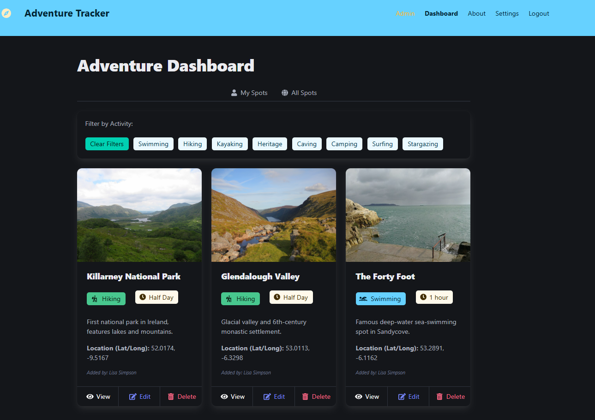 | **Category Filtering**<br>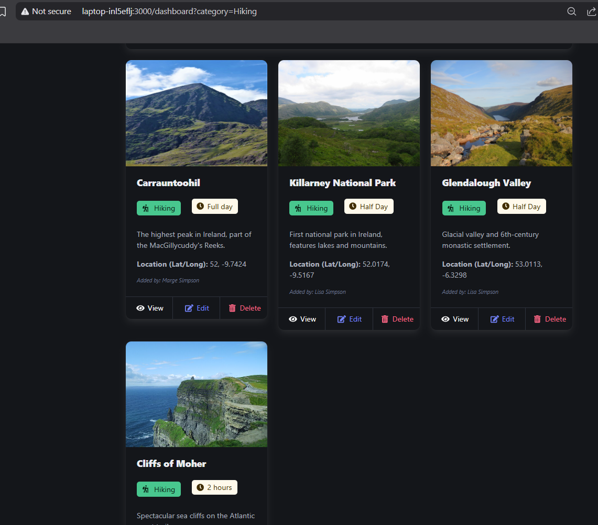 |
| **All Placemarks View**<br>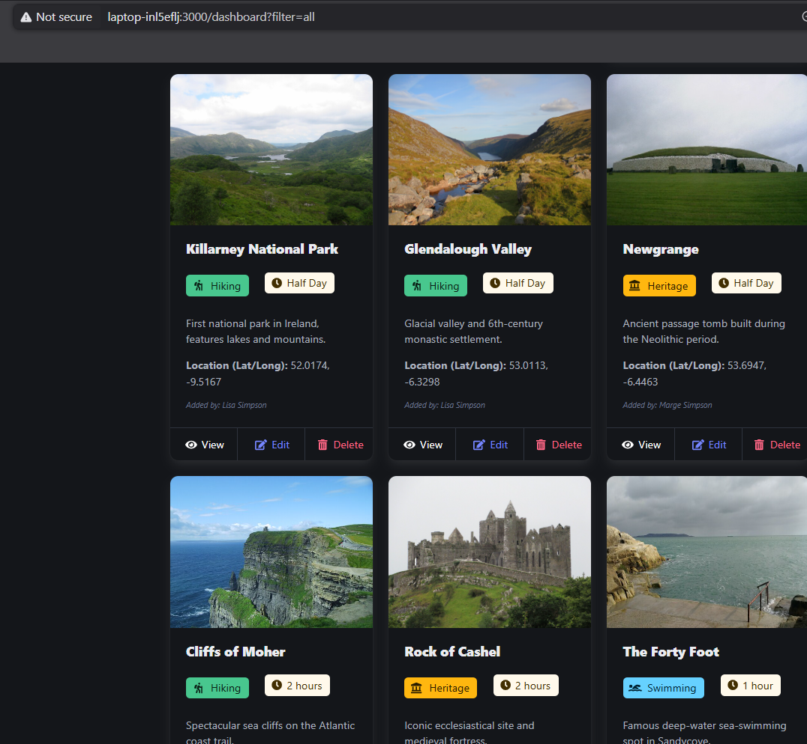 | **Global Dashboard Map**<br>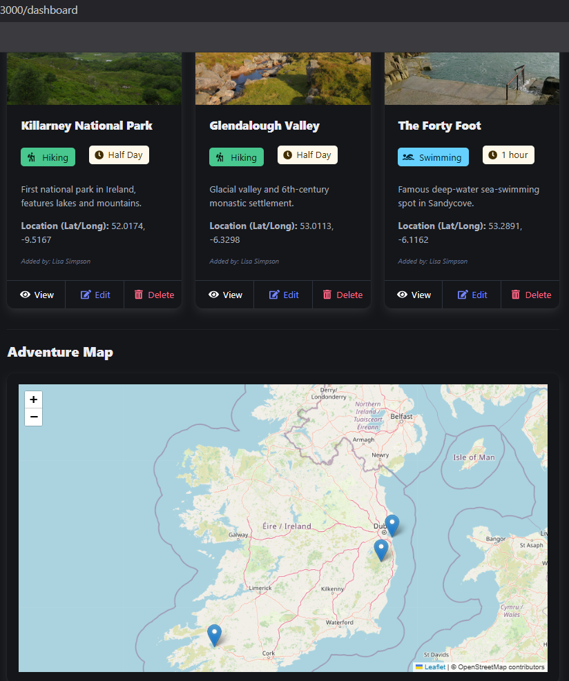 |

###  Placemark Details & Admin Controls
| Placemark Features | Admin Management |
|---|---|
| **Live OpenWeather Integration**<br>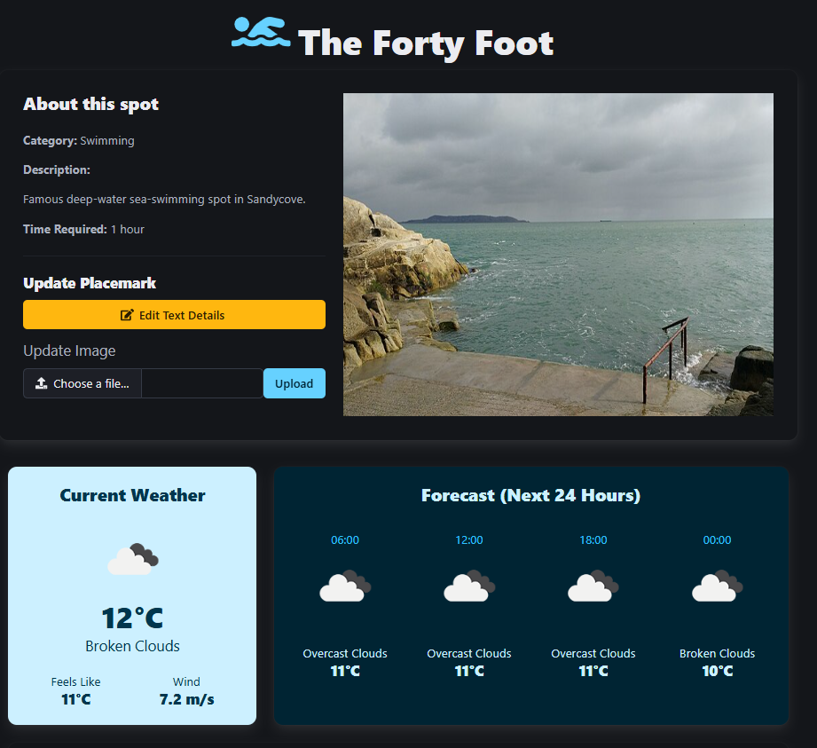 | **Admin Dashboard**<br>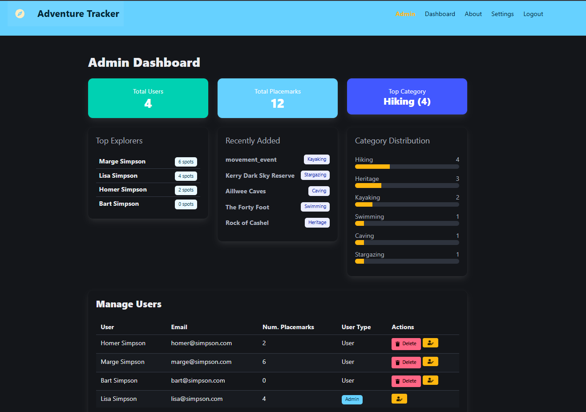 |
| **Individual Leaflet Map**<br>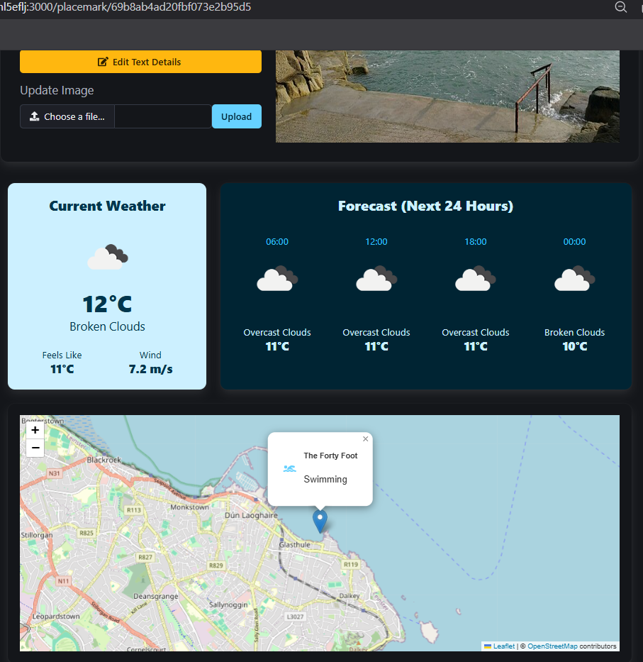 | **Admin User Editing**<br>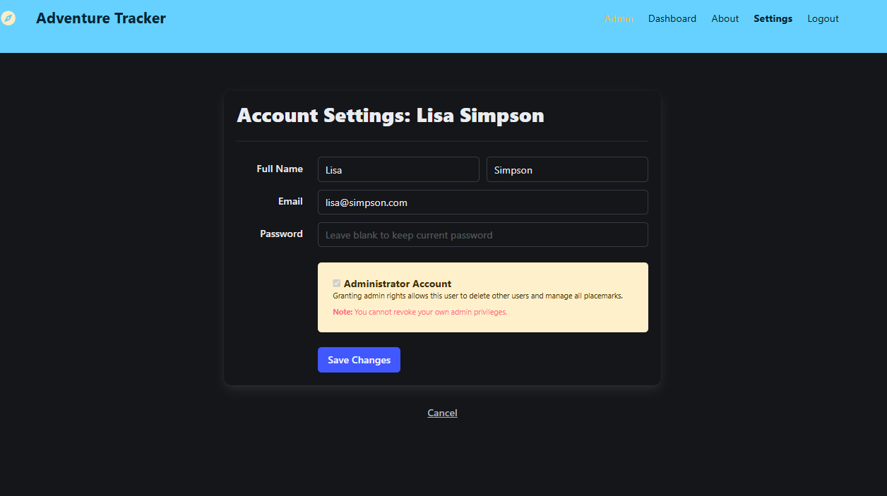 |

---

## Setup

### Local Setup
1. Clone the repository: `git clone <your-repo-link>`
2. Install dependencies: `npm install`
3. Create a `.env` file in the root directory and add:

    ```env
    cookie_name=placemark_session
   cookie_password=secure_password_string
   
   # Database Connections
   db=mongodb://your_mongo_connection_string
   FIREBASE_PROJECT_ID=your_firebase_project_id
   FIREBASE_CLIENT_EMAIL=your_firebase_client_email
   FIREBASE_PRIVATE_KEY="your_firebase_private_key"
   
   # Media Management
   cloudinary_name=your_name
   cloudinary_key=your_key
   cloudinary_secret=your_secret
   ```
4. Start the server: 

    ```node
    npm run dev
    ``` 
5. Access the server at http://localhost:3000
6. View API docs at http://localhost:3000/documentation
7. Run the tests: 
    ```node
    npm run test
    ``` 

### Deployment/Database & Infrastructure Configuration (level 4/5)
---

<details><summary><b>Mongo Atlas Database (Level 3/4)</b></summary>

The application uses *Mongoose* to connect to MongoDB Atlas. Upon first start, the database is automatically seeded with default users and placemarks (see `src/models/mongo`).

 **Setup:** 
1. Create a free account at [MongoDB Atlas](https://www.mongodb.com/cloud/atlas).
2. Build a new cluster.
3. Under **Network Access**, add the IP address `0.0.0.0/0` to allow access from anywhere (or restrict it to your specific IP/AWS IP for better security).
4. Under **Database Access**, create a new database user and save the password.
5. Click **Connect**, choose "Connect your application", and copy the connection string.
6. Replace `<password>` with your user password and add it to your `.env` file as `db=...`
</details>

<details>
<summary><b>Cloudinary (Media Storage) (Level 4)</b></summary>

- Used for image persistence in Placemarks.
- **Logic:** Images are uploaded via the Hapi-Inert payload handler and the URL is stored in the Mongo POI document.

**Setup:** 
1. Sign up for a free account at [Cloudinary](https://cloudinary.com/).
2. Navigate to your Dashboard.
3. Copy your **Cloud Name**, **API Key**, and **API Secret**.
4. Add these into your `.env` file (`cloudinary_name`, `cloudinary_key`, `cloudinary_secret`).
</details>

<details>
<summary><b>Firebase/Firestore (Level 4)</b></summary>

- Used as a secondary data store for persistent audit logs/activity data.
- **Setup:**
    1. Create a project in [firebase console](https://console.firebase.google.com/).
    2. Create a project and generate a private key from 'Services Accounts' tab.
    2. Download `serviceAccountKey.json` located in the root folder of project.
</details>

<details>
<summary><b> AWS EC2 (Level 4)</b></summary>

1. Launch an **Ubuntu T2.Micro** instance from the AWS EC2 Dashboard. Assign an Elastic IP address.

2. Configure your Security Group to allow inbound traffic on ports **22 (SSH)**, **80 (HTTP)**, **443 (HTTPS)**, and **3000 (Custom TCP)**.

3. SSH into your instance using your `.pem` key.

4. Install Node.js and Git:
   ```bash
   sudo apt update
   sudo apt install nodejs npm git
   ```

5. Clone this repository and run `npm install`.

6. Create your .env file on the server with all the credentials listed above.

7. Install PM2 globally to keep the app running 24/7:

Bash
```
sudo npm install -g pm2
pm2 start src/server.js --name "placemark"
pm2 save
pm2 startup
```
Your app will now be running on your EC2 instance's Public IPv4 address at port 3000!
</details>


<details>
<summary><b> Render (Alternative Cloud)</b></summary>

**Setup**: Connect GitHub repo to Render.com.

**Build Command**: npm install

**Start Command**: node src/server.js (Ensure all .env variables are added to Render's "Environment" tab).
</details>

---

## Unit Testing & Architecture (Mocha & Chai)

The test suite achieves a 100% pass rate across 42 distinct test cases and is designed for isolation:
* **Environment:** Tests force the `NODE_ENV` to `test` to prevent seed data from corrupting the test fixtures.
* **Coverage**: Includes Model Unit Tests (Persistence logic), API Tests (Axios CRUD), and Security Tests validating JWT token rejection for unauthorized routes.
* **Adaptability:** Tests are designed for interchangeable use of model stores. You can change the model used by altering `db.init("mongo")` to `mem`, `json`, or `firebase` in the setup blocks of the test files.
* **Architecture Highlights:** Addressed polluted fixture bugs by using JS spread operators to prevent memory stores from mutating shared test fixtures. Standardized cross-database return values to ensure tests pass regardless of the active DB engine.

## User and Admin Management
* Role-Based Access Control: Distinct views and permissions for standard Users and Administrators.
* Admin Dashboard: Real-time analytics showing total user engagement and placemark distribution (Level 4).
* Account Settings: Secure profile management allowing users to update credentials and Admins to promote/demote accounts, with logic checks to prevent them deleting themselves or removing their admin status (Level 5).
* Cascade Delete: deleting a user automatically triggers a cascade delete of their associated placemarks (Level 5).

## Adventure Cataloging
* Categorisation: Organise spots by activity (Hiking, Swimming, etc.)
* Filter to just user's spots or explore by filtering to all spots in the dashboard.
* Image Management: Integrated image uploading and updating supported by Cloudinary, with fallback placeholders.
* Leaflet Maps: Interactive map integration. Every placemark is rendered with a custom marker based on its latitude and longitude coordinates. Dashboard contains global map of all placemarks on the site (level 5) and clicking on placemark details in global map will bring you to that placemark.
* Live Weather Integration: Real-time weather data and 24 hour forecasts fetched via the OpenWeatherMap API for every location (level 5).

## Git Workflow
This project follows **Git Flow** (Level 4). Releases are tagged accordingly (1.0.0 through 5.0.0). Feature branches were used to develop features e.g. admin dashboard and then merged back to develop using Git Flow workflow.

## ⚙️ Infrastructure & API Proof

*Click to expand and view the backend infrastructure proving Level 4 integration.*

<details>
<summary><b>1. Swagger API Documentation</b></summary>
The API is structured to follow RESTful principles. All endpoints (except login/signup) require a JWT token in the Authorization header.

* POST /api/users/authenticate: Login to receive a JWT.
* GET /api/placemarks: Retrieve all placemarks (Admin user only).
* POST /api/placemarks: Create a new adventure spot.
* DELETE /api/placemarks/{id}: Remove a specific spot.
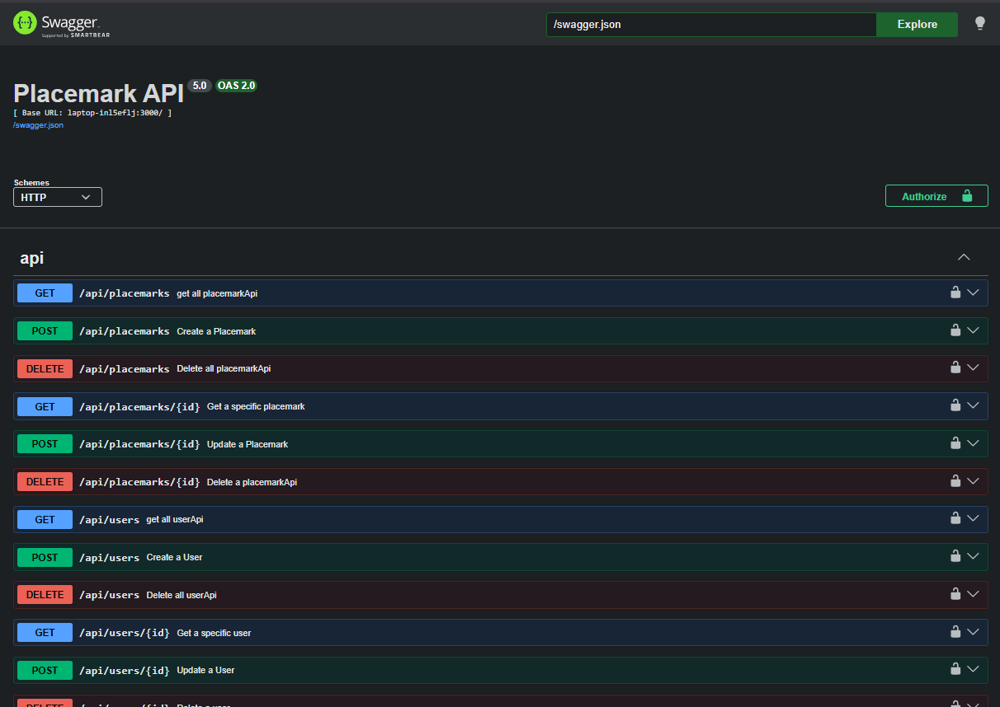
</details>

<details>
<summary><b>2. MongoDB Atlas (Cloud Data Persistence)</b></summary>
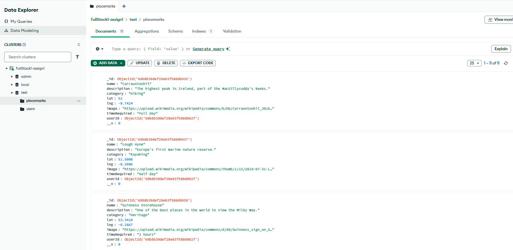
</details>

<details>
<summary><b>3. Firebase Firestore (Alternative Data Store)</b></summary>
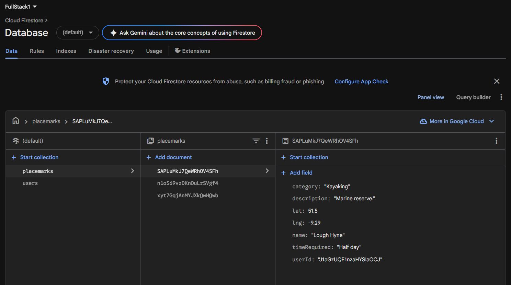
</details>

<details>
<summary><b>4. AWS EC2 Production Deployment</b></summary>
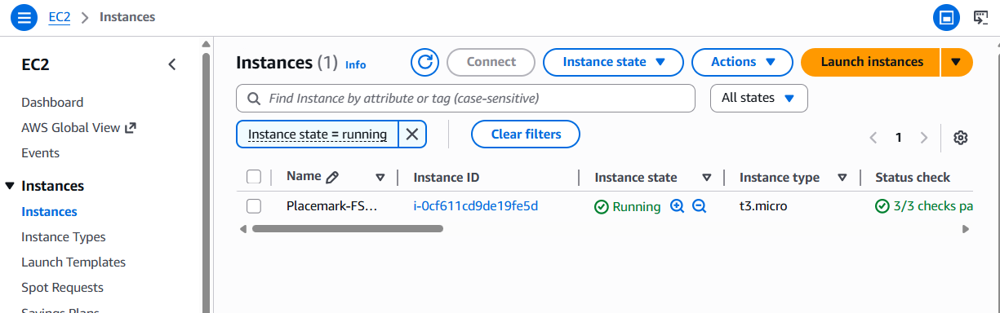
</details>